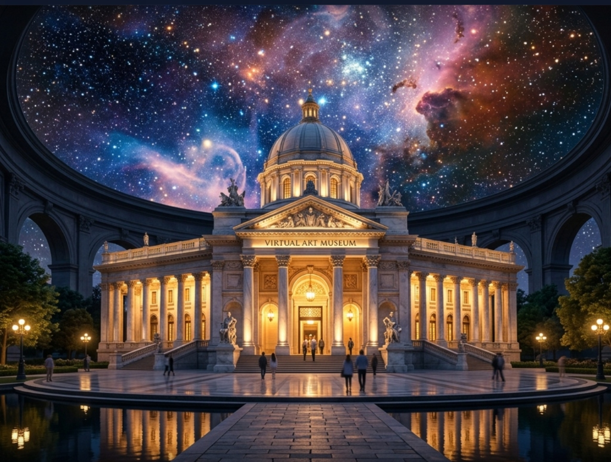

# Virtual Art Museum (Godot 4)

Welcome to the **Virtual Art Museum**! This is a state-of-the-art, procedurally generated 3D museum built natively in Godot 4.
It is designed to showcase beautiful AI-generated paintings in a luxurious, real-time rendered architectural space.

## Features
- **Procedural Architecture**: The entire museum—including the central hub, radial corridors, imposing portal, and exterior plaza—is generated at runtime using CSG mechanics and dynamic meshes.
- **VR Integration**: Built-in support for OpenXR and high-end headsets (like the PSVR2 via SteamVR) for full stereoscopic immersion. Can also be launched in 2D Desktop mode.
- **Dynamic Graphics & Atmosphere**: Adjust MSAA, V-Sync, lighting moods, and Software Raytracing (SDFGI) seamlessly via a built-in UI overlay.
- **The Universe Room**: An interactive drop sequence taking you from the classical museum straight into an infinite view of the cosmos.
- **Modular Artist Integration**: Easily add new artists and galleries via the `artists/` folder.

## Getting Started
1. Open the project in **Godot 4**.
2. Run `startup.tscn` (or `main.tscn` for direct launch).
3. Select whether you want to play in Desktop mode or 3D VR mode.

*For more details on the code structure and logic, please see [doc/Architecture_and_Features.md](doc/Architecture_and_Features.md).*
